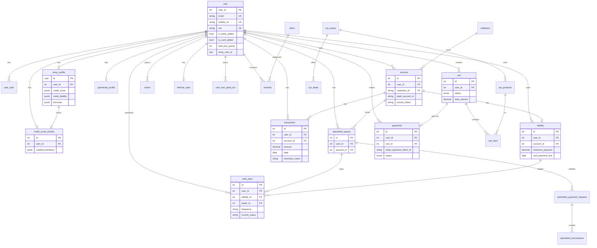
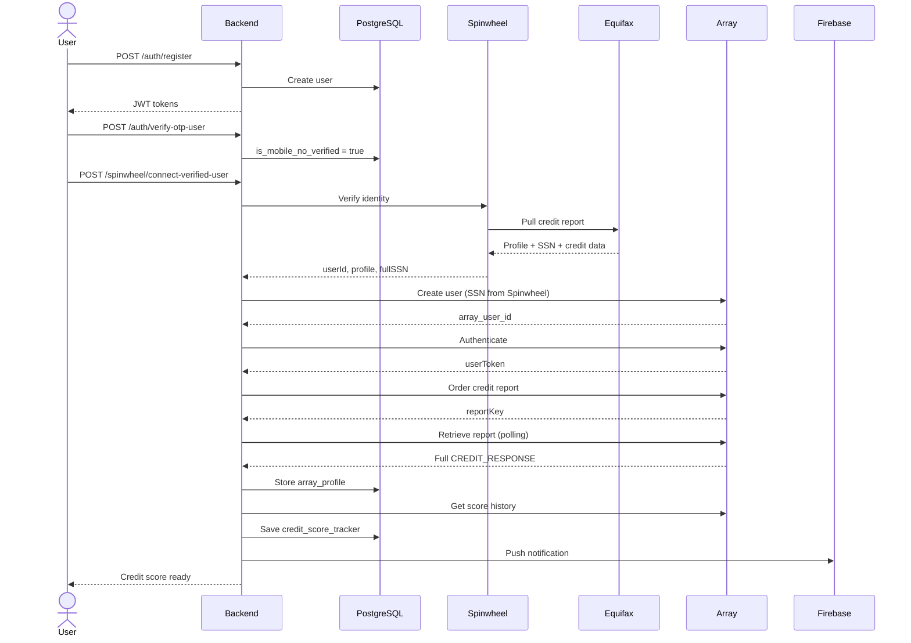
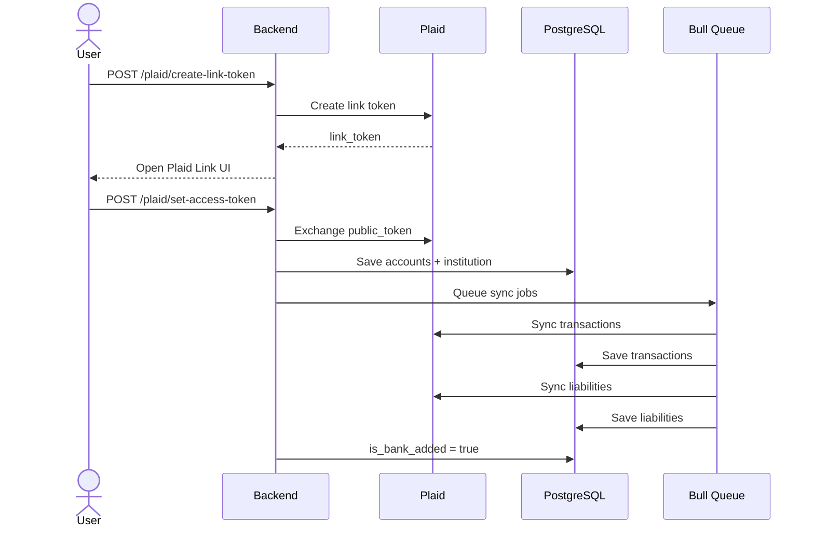
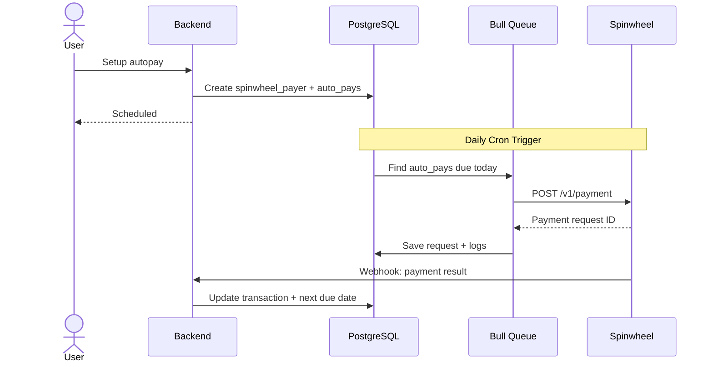
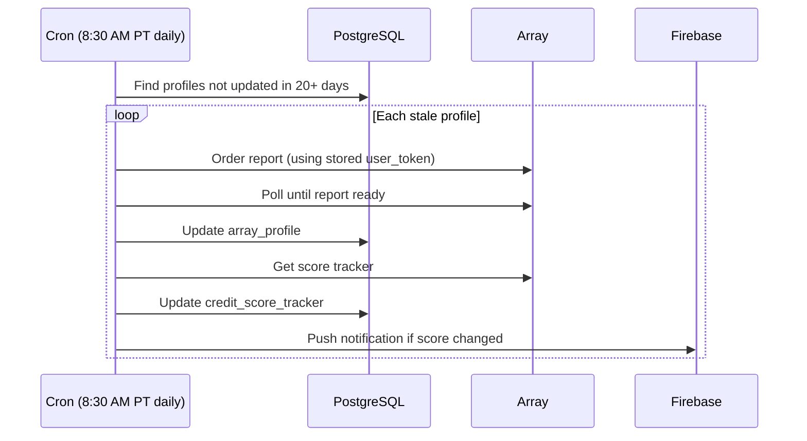
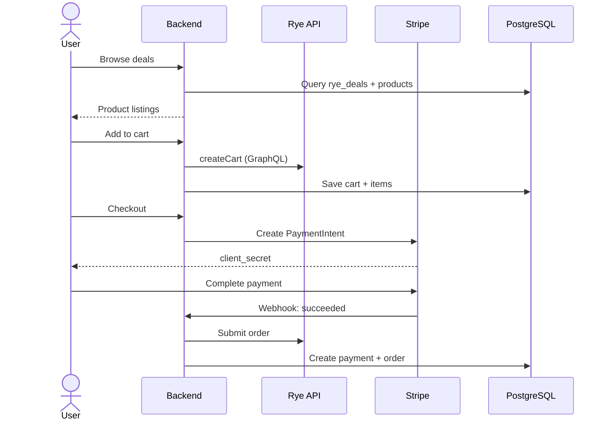

# BON Credit — System Design Document

> **Purpose:** One-shot onboarding reference for new engineers joining BON Credit.
> **Last Updated:** May 6, 2026
> **Author:** Nilesh Kumar (Backend Engineer) + Alaska (PM)
> **Repo:** `Bonhq/bon_webservices` (backend)

---

## Table of Contents

1. [Product Overview](#1-product-overview)
2. [Team](#2-team)
3. [Tech Stack](#3-tech-stack)
4. [Project Structure](#4-project-structure)
5. [External Integrations](#5-external-integrations)
6. [Database Schema (ERD)](#6-database-schema-erd)
7. [Core Data Pipelines](#7-core-data-pipelines)
8. [User Journey](#8-user-journey)
9. [Sequence Diagrams](#9-sequence-diagrams)
10. [Background Jobs & Cron](#10-background-jobs--cron)
11. [Auth & RBAC](#11-auth--rbac)
12. [Deployment Architecture](#12-deployment-architecture)
13. [Known Issues & Tech Debt](#13-known-issues--tech-debt)
14. [Questions to Ask on Day 1](#14-questions-to-ask-on-day-1)
15. [Glossary](#15-glossary)

---

## 1. Product Overview

**BON Credit** is a fintech app for US consumers focused on **credit health improvement + rewards marketplace**.

### What Users Get

| Feature | Description |
|---|---|
| **Credit Reports** | Pull and view credit reports from Equifax via Array |
| **Credit Score Tracking** | Historical score monitoring, refreshed every ~20 days |
| **CredGPT** | AI-powered credit analysis — personalized insights and improvement tips |
| **Bank/Card Linking** | Connect bank accounts and credit cards via Plaid |
| **AutoPay** | Automated credit card bill payments via Spinwheel |
| **Budgeting & Insights** | AI-driven spending analysis from transaction data |
| **Deals & Rewards** | Affiliate e-commerce marketplace, gift cards, BON Points |
| **Daily Drops & Lucky Draws** | Gamification for daily engagement |
| **Referrals** | Invite friends → both earn BON Points |

### Two Products in One

```
┌─────────────────────────────────────────────────────────┐
│                     BON Credit App                       │
├─────────────────────────┬───────────────────────────────┤
│   CREDIT HEALTH         │   REWARDS MARKETPLACE         │
│                         │                               │
│   • Credit reports      │   • Browse deals (Rye)        │
│   • Score tracking      │   • Daily drops               │
│   • CredGPT analysis    │   • Lucky draws               │
│   • Bank linking        │   • Gift cards (Tremendous)   │
│   • AutoPay             │   • BON Points economy        │
│   • Card matching       │   • Referral rewards          │
│                         │                               │
│   Plaid + Array +       │   Rye + Stripe +              │
│   Spinwheel             │   Tremendous                  │
└─────────────────────────┴───────────────────────────────┘
```

The rewards marketplace exists as a **retention strategy** — giving users reasons to open the app beyond checking their credit score (same playbook as Cash App Boosts, Credit Karma offers).

---

## 2. Team

| Name | Role | Location | Key Responsibilities |
|---|---|---|---|
| **Abhinav Jain** | Head of Product & Design | India | Product decisions, design, sprint planning |
| **Samder Khangarot** | Co-founder, CEO | US (SF) | Business strategy, partnerships |
| **Darwin Tu** | Co-founder, COO | US (SF) | Operations, analytics validation |
| **Pankaj Pal** | Frontend Engineer | India | Flutter app, Node.js |
| **Sandeep Singh** | AI Engineer | India | Python/LangGraph, AI agents, DevOps, all infra |
| **Shailesh** | AI Engineer | India | AI development |
| **Nilesh Kumar** | Backend Engineer | India | Node.js backend, APIs, integrations |
| **Tarun** | QA Intern | India | Testing |

### Who Owns What

- **App code (Flutter):** Pankaj → `Bonhq/bon_app`
- **Backend code (Node.js):** Nilesh / previously Sai (MobileFirst) → `Bonhq/bon_webservices`
- **AI layer (Python):** Sandeep → `Bonlife/BON-CredGPT`
- **All infra, CI/CD, K8s, Terraform:** Sandeep → `Bonlife/BON-EKS`, `Bonlife/BON-Terraform`
- **Product + Design:** Abhinav

### External Agency — MobileFirst (transitioning off ~May 2026)

Previous dev agency. Key contact: **Sai** (built original backend). Their work is being handed over to the internal team.

---

## 3. Tech Stack

### Backend (`bon_webservices`)

| Layer | Technology |
|---|---|
| **Runtime** | Node.js (≥12) |
| **Framework** | Express.js |
| **ORM** | Sequelize |
| **Database** | PostgreSQL (SSL, connection pooling) |
| **Cache** | Redis |
| **Job Queue** | Bull (Redis-backed) |
| **Auth** | JWT (access + refresh tokens), Google OAuth, Apple OAuth |
| **Validation** | Hapi/Joi |
| **API Docs** | Swagger (`/v1/docs`) |
| **Logging** | Winston + Morgan |
| **Email** | SendGrid (primary), Postmark (status unclear) |
| **SMS** | Twilio (A2P pending), Plivo (status unclear) |
| **Push** | Firebase Admin SDK |
| **Payments** | Stripe |

### AI Layer (separate repos, Sandeep owns)

| Technology | Purpose |
|---|---|
| Python | Core language |
| LangChain + LangGraph | Agent framework |
| Langfuse | LLM observability/tracing |

### Infrastructure (Sandeep owns)

| Technology | Purpose |
|---|---|
| AWS EKS | Kubernetes cluster |
| Terraform | Infrastructure-as-code |
| Jenkins | CI (builds Docker images) |
| ArgoCD | CD (deploys to EKS) |
| Docker | Containerization |
| ECR | Container registry |

### Mobile (Pankaj owns)

| Technology | Purpose |
|---|---|
| Flutter | Cross-platform mobile app |
| Firebase | Push notifications, analytics |

---

## 4. Project Structure

```
bon_webservices/
├── package.json              # Dependencies, scripts
├── src/
│   ├── index.js              # Entry point — starts Express server on port 3000
│   ├── app.js                # Express app setup, middleware chain
│   ├── config/
│   │   ├── config.js         # All env vars: DB, Redis, Spinwheel, Array, Mixpanel, etc.
│   │   ├── plaid.js          # Plaid client initialization
│   │   ├── spinwheel.js      # Spinwheel config validation
│   │   ├── ryeConfig.js      # Rye API config
│   │   ├── postgres.js       # DB connection
│   │   ├── jwt.js            # JWT config
│   │   ├── logger.js         # Winston logger
│   │   ├── morgan.js         # HTTP request logging
│   │   ├── roles.js          # Role definitions
│   │   └── googleClient.js   # Google OAuth
│   ├── controllers/          # 48 request handlers (one per domain)
│   ├── services/             # Business logic layer
│   │   ├── accounts/         # Plaid account sync logic
│   │   ├── autopays/         # AutoPay business logic
│   │   ├── liabilities/      # Liability sync logic
│   │   └── transaction/      # Transaction processing
│   ├── db/
│   │   ├── models/           # ~75 Sequelize models
│   │   ├── migrations/       # Schema changes (Sequelize)
│   │   ├── seeders/          # Seed data
│   │   └── config/           # DB connection config
│   ├── routes/v1/            # All API routes (versioned v1)
│   ├── middlewares/
│   │   ├── auth.js           # JWT auth for regular users
│   │   ├── adminDashboard.js # Real RBAC — role + page + action permissions
│   │   ├── admin.auth.js     # ⚠️ DEAD CODE — just duplicates JWT check
│   │   ├── rateLimiter.js    # Rate limiting
│   │   ├── validate.js       # Joi schema validation
│   │   └── error.js          # Error handler
│   ├── jobs/                 # Cron jobs
│   │   ├── daily-autopay.job.js
│   │   ├── weekly-notification.job.js
│   │   ├── daily-drop-notification.job.js
│   │   └── offer-update.job.js
│   ├── schedulers/           # Bull queue processors
│   │   ├── bull.js           # Queue definitions
│   │   ├── notification.process.js
│   │   ├── accounts/sync-account.process.js
│   │   ├── transactions/     # sync, add, update, remove
│   │   ├── liabilities/update-liabilities.process.js
│   │   └── autopays/autopay.process.js
│   ├── validations/          # Joi input schemas
│   ├── utils/                # Helpers, encryption, constants
│   ├── static/               # Static assets
│   └── public/               # Public files, deep links
├── flyway/                   # Flyway migrations (dual migration system)
│   ├── flyway.conf
│   └── sql/
└── push/                     # Push notification assets
```

### Key File Locations

| What You Need | Where To Find It |
|---|---|
| All API routes | `src/routes/v1/index.js` (route registry) |
| Plaid integration | `src/controllers/plaid.controller.js`, `src/config/plaid.js` |
| Array (credit reports) | `src/controllers/array.controller.js` |
| Spinwheel (identity + payments) | `src/controllers/spinwheel.controller.js`, `src/services/spinwheel.service.js` |
| Rye (e-commerce) | `src/services/rye.service.js`, `src/controllers/rye.controller.js` |
| Stripe (payments) | `src/controllers/stripe.controller.js`, `src/controllers/stripeWebhook.controller.js` |
| AutoPay | `src/schedulers/autopays/autopay.process.js`, `src/db/models/AutoPays.model.js` |
| Auth/login | `src/controllers/auth.controller.js`, `src/routes/v1/auth.route.js` |
| Push notifications | `src/services/pushNotification.service.js`, `src/services/firebase.service.js` |
| All DB models | `src/db/models/` |
| Environment config | `src/config/config.js` (reads from `.env`) |

---

## 5. External Integrations

### The Big Three (Core Fintech)

#### Plaid — Banking Data Middleware
- **What:** Connects users to their bank accounts and credit cards securely
- **Data we get:** Accounts, transactions, balances, liabilities, income
- **How:** User completes Plaid Link UI in app → we get access token → sync data via API
- **Package:** `plaid` npm
- **Config:** `src/config/plaid.js`
- **Controller:** `src/controllers/plaid.controller.js`
- **Key concept:** Plaid aggregates 12,000+ financial institutions into a single API. Without it, we'd integrate with every bank individually.
- **Known issue:** Card linking has had ~70% failure rate historically

#### Array — Credit Report Aggregator
- **What:** Pulls credit reports and scores from bureaus (Equifax, TransUnion, Experian)
- **Data we get:** Full credit report (borrower, liabilities, inquiries, scores, summary), score history
- **How:** Create user → authenticate (SMFA) → order report → retrieve → store
- **Why not direct bureau integration?** Array handles FCRA compliance, permissible purpose, dispute flows
- **Cost:** Expensive — we only refresh every ~20 days per user (cron at `src/controllers/array.controller.js:1447`)
- **Config:** `src/config/config.js` (array.token, array.serverToken, array.hostName)
- **Controller:** `src/controllers/array.controller.js`

#### Spinwheel — Identity + Debt Payments
- **What:** Two roles:
  1. **Identity verification** — verifies user via Equifax, gets SSN and profile data
  2. **Debt payments** — executes credit card bill payments (AutoPay feature)
- **How Spinwheel triggers Array:** When a user verifies via Spinwheel, the backend automatically creates an Array user using the SSN from Spinwheel and pulls the first credit report. See the chain at `src/controllers/spinwheel.controller.js:193-219`.
- **Config:** `src/config/spinwheel.js`, `src/config/config.js`
- **Service:** `src/services/spinwheel.service.js`
- **Controller:** `src/controllers/spinwheel.controller.js`

### Spinwheel + Array: How They Work Together

```
NEW USER ONBOARDING:
  Spinwheel verifies identity → gets SSN + profile
    → Backend creates Array user with that SSN
    → Backend orders + retrieves first credit report from Array
    → User sees their credit score

ONGOING (every ~20 days):
  Array cron re-pulls credit report directly (no Spinwheel needed)

ON-DEMAND:
  When user adds a card not found in Array data → Spinwheel does real-time lookup
```

### Commerce & Payments

| Integration | Purpose | Key Files |
|---|---|---|
| **Rye** | Affiliate e-commerce — product catalog, carts, checkout via GraphQL | `src/services/rye.service.js`, `src/config/ryeConfig.js` |
| **Stripe** | Payment processing for e-commerce purchases | `src/controllers/stripe.controller.js` |
| **Tremendous** | Gift card / reward payouts | `src/controllers/tremendous.webhook.controller.js` |

### Messaging & Notifications

| Integration | Purpose | Status |
|---|---|---|
| **Firebase Admin** | Push notifications to iOS/Android | Active |
| **SendGrid** | Transactional emails | Active (primary) |
| **Postmark** | Email (alternative) | Status unclear — ask Abhinav |
| **Twilio** | SMS | A2P registration pending — currently blocked |
| **Plivo** | SMS (alternative) | Status unclear — ask Abhinav |
| **Customer.io** | Campaigns, push, email orchestration | Active (triggered externally, not in backend code) |

### Analytics

| Integration | Purpose | Status |
|---|---|---|
| **Mixpanel** | DAU, retention, active users | In code (`src/controllers/mixpanel.controller.js`) but team uses Amplitude now — may be deprecated |
| **Amplitude** | Primary analytics platform | Used by team, triggered from app/frontend |

---

## 6. Database Schema (ERD)

### Relationship Overview

```
USER (center of everything)
  │
  ├── FINANCIAL DATA (Plaid)
  │     ├── institution (bank)
  │     ├── account (bank/card account)
  │     ├── transaction (purchases, payments)
  │     ├── liability (credit card debt)
  │     └── income
  │
  ├── CREDIT DATA (Array)
  │     ├── array_profile (full credit report as JSONB)
  │     └── credit_score_tracker (score history)
  │
  ├── DEBT & PAYMENTS (Spinwheel)
  │     ├── spinwheel_profile (identity + credit cards)
  │     ├── spinwheel_payers (payment source accounts)
  │     ├── auto_pays (scheduled payments)
  │     ├── spinwheel_payment_requests (individual payments)
  │     └── spinwheel_transactions (payment results)
  │
  ├── COMMERCE (Rye + Stripe)
  │     ├── cart → cart_items
  │     ├── checkout_intent
  │     ├── payments (Stripe)
  │     ├── orders → order_items → order_events → order_tracking
  │     └── stripe_customers
  │
  ├── REWARDS & ENGAGEMENT
  │     ├── user_bon_point_txn (points ledger)
  │     ├── referral + referral_code + referral_rewards
  │     ├── rewards
  │     ├── daily_drop_user + daily_drop_winners
  │     ├── user_deals, user_exclusive, user_jackpot, user_wishlist
  │     └── user_product_unlocks
  │
  └── AUTH & ADMIN
        ├── user_auth (login methods + OTP)
        ├── user_session (JWT tokens)
        └── admin_users, employee, role, role_permissions, user_roles
```

### Full ERD (Mermaid)

Paste into [mermaid.live](https://mermaid.live) to render:



### Key Model Files

| Domain | Models | Location |
|---|---|---|
| User | `user`, `user_auth`, `user_session` | `src/db/models/user.model.js`, `user_auth.model.js`, `user_session.model.js` |
| Plaid | `account`, `transaction`, `liability`, `institution`, `income` | `src/db/models/account.model.js`, etc. |
| Array | `array` (ArrayProfile), `arrayCreditScoreTracker` | `src/db/models/array.model.js`, `arrayCreditScoreTracker.model.js` |
| Spinwheel | `spinwheelProfile`, `spinwheelPayers`, `AutoPays`, `SpinwheelPaymentRequest`, `SpinwheelTransaction`, `SpinwheelPayToPlatLogs` | `src/db/models/spinwheel*.model.js`, `AutoPays.model.js` |
| Commerce | `ryeStore`, `ryeProduct`, `ryeDeal`, `cart`, `cartItem`, `Payment`, `order` | `src/db/models/rye*.model.js`, `cart.model.js`, etc. |
| Rewards | `reward`, `referral`, `referralCode`, `userBonPointTxn`, `offer` | `src/db/models/reward.model.js`, etc. |
| Admin | `user_admin`, `employee`, `role`, `role_permissions`, `user_roles`, `pages` | `src/db/models/role.model.js`, etc. |

---

## 7. Core Data Pipelines

### Pipeline A: Credit Data (Spinwheel → Array)

```
                    FIRST TIME (Onboarding)
┌──────────┐    ┌──────────────┐    ┌──────────────┐    ┌──────────┐
│ User App │───▶│  Spinwheel   │───▶│   Equifax    │───▶│  Array   │
│          │    │ (verify SSN) │    │ (credit pull)│    │ (report) │
└──────────┘    └──────────────┘    └──────────────┘    └──────────┘
                       │                                      │
                       │ SSN + profile                        │ Full credit report
                       ▼                                      ▼
                ┌──────────────────────────────────────────────────┐
                │              PostgreSQL                          │
                │  spinwheel_profile │ array_profile │ score_tracker│
                └──────────────────────────────────────────────────┘

                    ONGOING (Every ~20 days)
                ┌──────────┐    ┌──────────┐    ┌──────────┐
                │  Cron    │───▶│  Array   │───▶│   DB     │
                │ (8:30 PT)│    │  API     │    │ (update) │
                └──────────┘    └──────────┘    └──────────┘
```

**Code references:**
- Spinwheel → Array chain: `src/controllers/spinwheel.controller.js:193-219`
- Array cron (20-day refresh): `src/controllers/array.controller.js:1404-1449`
- Array "AfterSpinwheel" functions: `src/controllers/array.controller.js:498, 692, 912, 1083, 1769`

### Pipeline B: Financial Data (Plaid)

```
┌──────────┐    ┌──────────┐    ┌──────────┐    ┌──────────┐
│ User App │───▶│  Plaid   │───▶│ Backend  │───▶│   DB     │
│ (Link UI)│    │  Link    │    │ (sync)   │    │          │
└──────────┘    └──────────┘    └──────────┘    └──────────┘
                                     │
                              ┌──────┴──────┐
                              ▼             ▼
                        ┌──────────┐  ┌──────────┐
                        │ Bull Q   │  │ Bull Q   │
                        │ (txns)   │  │ (liab.)  │
                        └──────────┘  └──────────┘
```

**Code references:**
- Plaid config: `src/config/plaid.js`
- Plaid controller: `src/controllers/plaid.controller.js`
- Transaction sync: `src/schedulers/transactions/sync-transaction.process.js`
- Liability sync: `src/schedulers/liabilities/update-liabilities.process.js`
- Account sync: `src/schedulers/accounts/sync-account.process.js`

### Pipeline C: Payments (AutoPay)

```
┌──────────┐    ┌──────────┐    ┌──────────┐    ┌──────────┐
│ auto_pays│───▶│ Bull Q   │───▶│Spinwheel │───▶│ Webhook  │
│ (cron)   │    │ (process)│    │(pay API) │    │ (result) │
└──────────┘    └──────────┘    └──────────┘    └──────────┘
```

**Code references:**
- AutoPay model: `src/db/models/AutoPays.model.js`
- AutoPay processor: `src/schedulers/autopays/autopay.process.js`
- Spinwheel payment service: `src/services/spinwheel.service.js`

---

## 8. User Journey

### Complete Flow (from signup to daily usage)

```
STEP 1: REGISTER
├── POST /auth/register (email + password)
├── POST /auth/google-login (Google OAuth)
└── POST /auth/apple-login (Apple OAuth)
    → Creates user record, returns JWT tokens
    → src/routes/v1/auth.route.js:11-14

STEP 2: VERIFY PHONE
├── GET /auth/send-otp-phone → sends OTP
└── POST /auth/verify-otp-user → verifies
    → is_mobile_no_verified = true
    → src/routes/v1/auth.route.js:44-45

STEP 3: IDENTITY VERIFICATION + FIRST CREDIT PULL
├── POST /spinwheel/connect-verified-user {SSN, name, DOB, address}
│   → Spinwheel verifies identity via Equifax
│   → Gets full credit profile + SSN
│   → Auto-creates Array user
│   → Orders + retrieves first credit report
│   → Saves score history
│   → src/controllers/spinwheel.controller.js:170-230
└── User can now see their credit score and report

STEP 4: LINK BANK ACCOUNT
├── POST /plaid/create-link-token → opens Plaid Link UI
├── User completes Plaid Link in app
└── POST /plaid/set-access-token → stores access token
    → Syncs accounts, transactions, liabilities, income
    → is_bank_added = true
    → src/routes/v1/plaid.route.js

STEP 5: ONGOING USAGE
├── Credit monitoring (Array cron every ~20 days)
├── CredGPT analysis (AI layer, separate service)
├── AutoPay (scheduled credit card payments)
├── Browse deals + earn/spend BON Points
├── Daily drops, lucky draws
└── Refer friends → earn rewards
```

---

## 9. Sequence Diagrams

### Signup + Onboarding + First Credit Pull



### Plaid Bank Linking



### AutoPay Execution



### Array 20-Day Credit Refresh



### E-Commerce Purchase



---

## 10. Background Jobs & Cron

| Job | Type | Schedule | File |
|---|---|---|---|
| **Array credit refresh** | node-cron | Daily 8:30 AM PT, profiles >20 days old | `src/controllers/array.controller.js:1447` |
| **Rye store/product sync** | On startup | Continuous, self-healing | `src/index.js` |
| **AutoPay processing** | Bull queue | On schedule (per auto_pay record) | `src/schedulers/autopays/autopay.process.js` |
| **Transaction sync** | Bull queue | On demand (after Plaid link) | `src/schedulers/transactions/sync-transaction.process.js` |
| **Transaction add** | Bull queue | On webhook | `src/schedulers/transactions/add-transaction.process.js` |
| **Transaction update** | Bull queue | On webhook | `src/schedulers/transactions/update-transaction.process.js` |
| **Transaction remove** | Bull queue | On webhook | `src/schedulers/transactions/remove-transaction.process.js` |
| **Account sync** | Bull queue | On demand | `src/schedulers/accounts/sync-account.process.js` |
| **Liability update** | Bull queue | On demand | `src/schedulers/liabilities/update-liabilities.process.js` |
| **Notifications** | Bull queue | Queued | `src/schedulers/notification.process.js` |
| **Daily autopay** | node-cron | Daily | `src/jobs/daily-autopay.job.js` |
| **Weekly notification** | node-cron | Weekly | `src/jobs/weekly-notification.job.js` |
| **Daily drop notification** | node-cron | Daily | `src/jobs/daily-drop-notification.job.js` |
| **Offer update** | node-cron | Periodic | `src/jobs/offer-update.job.js` |

---

## 11. Auth & RBAC

### Authentication Methods

| Method | Route | Who Uses It |
|---|---|---|
| Email + password | `POST /auth/register`, `POST /auth/login` | App users |
| Google OAuth | `POST /auth/google-login` | App users |
| Apple OAuth | `POST /auth/apple-login` | App users |
| Phone OTP | `GET /auth/send-otp-phone`, `POST /auth/verify-otp-user` | App users (verification) |
| Admin login | `POST /auth/admin-login` | Admin dashboard |
| Employee login | `POST /auth/employee-login` | Internal team |

### Middleware Stack

| Middleware | File | Purpose |
|---|---|---|
| `isAuth` | `src/middlewares/auth.js` | JWT verification for regular users. Checks blacklist via Redis. |
| `permission(page_ids, action)` | `src/middlewares/adminDashboard.js` | **Real RBAC.** Verifies JWT → looks up user role → checks `role_permissions` table for page + action (can_view/can_edit/can_delete). |
| `validateCookie` | `src/middlewares/admin.auth.js` | ⚠️ **Dead code.** Named "admin auth" but does zero admin checks — just duplicates JWT verification. Redundant on all 5 routes that use it. **Should be removed.** |
| `validate` | `src/middlewares/validate.js` | Joi schema validation |
| `rateLimiter` | `src/middlewares/rateLimiter.js` | Request rate limiting |

### RBAC Model

```
role (admin, editor, viewer, etc.)
  └── role_permissions
        ├── page_id (which admin page: offers=1, categories=2, deals=3, blog=4)
        ├── can_view (boolean)
        ├── can_edit (boolean)
        └── can_delete (boolean)
```

---

## 12. Deployment Architecture

```
┌──────────────────────────────────────────────────────────┐
│                    Developer Workflow                      │
├──────────────────────────────────────────────────────────┤
│                                                          │
│  Push to bon_webservices                                 │
│         │                                                │
│         ▼                                                │
│  ┌──────────────┐                                        │
│  │   Jenkins    │  CI — builds Docker image               │
│  │   (CI)       │  Dockerfile lives in BON-EKS repo       │
│  └──────┬───────┘                                        │
│         │                                                │
│         ▼                                                │
│  ┌──────────────┐                                        │
│  │   AWS ECR    │  Container registry                     │
│  │              │  Stores Docker images                    │
│  └──────┬───────┘                                        │
│         │                                                │
│         ▼                                                │
│  ┌──────────────┐                                        │
│  │   ArgoCD     │  CD — detects new image, deploys        │
│  │   (CD)       │  Reads K8s manifests from BON-EKS       │
│  └──────┬───────┘                                        │
│         │                                                │
│         ▼                                                │
│  ┌──────────────┐                                        │
│  │   AWS EKS    │  Kubernetes cluster                     │
│  │   (K8s)      │  Runs the containers                    │
│  └──────────────┘                                        │
│                                                          │
│  Infrastructure defined in: Bonlife/BON-Terraform         │
│  K8s manifests in: Bonlife/BON-EKS                        │
│  All infra owned by: Sandeep                              │
└──────────────────────────────────────────────────────────┘
```

**Key points:**
- No Dockerfiles in `bon_webservices` — that's intentional (separation of concerns)
- You push app code, Sandeep's pipeline handles the rest
- For deployment-related needs (env vars, scaling, new services), talk to Sandeep

### Repository Map

| Repo | Org | Owner | Purpose |
|---|---|---|---|
| `bon_app` | Bonhq | Pankaj | Flutter mobile app |
| `bon_webservices` | Bonhq | Nilesh (previously Sai) | Node.js backend API |
| `Landingpage` | Bonhq | — | Marketing website |
| `BON-CredGPT` | Bonlife | Sandeep | AI credit analysis engine |
| `Agentic-Dashboard` | Bonlife | Sandeep | Internal AI dashboard |
| `Agentic-Chat-UI` | Bonlife | Sandeep | Internal chat UI for testing |
| `BON-Terraform` | Bonlife | Sandeep | AWS infrastructure (Terraform) |
| `BON-EKS` | Bonlife | Sandeep | Kubernetes manifests, Helm charts |
| `BON-langfuse` | Bonlife | Sandeep | LLM observability (Langfuse) |

---

## 13. Known Issues & Tech Debt

### 🔴 Security — Unprotected Routes (No Auth)

These routes have **zero authentication middleware** — anyone on the internet can call them:

| Route | Risk | File |
|---|---|---|
| `POST /array/create-array-user` | Creates credit bureau users | `src/routes/v1/array.route.js:46` |
| `POST /array/order-credit-report` | Orders credit reports | `:52` |
| `POST /array/retrieve-credit-report` | Retrieves credit reports | `:55` |
| `GET /array/get-array-user` | Gets Array user data | `:62` |
| `GET /array/order-retrieve-credit-report` | Orders + retrieves reports | `:67` |
| `POST /array/get-score-tracker` | Gets score data | `:76` |
| `POST /categories/upload` | Bulk upload | `src/routes/v1/category.route.js:13` |
| `POST /deals/upload` | Bulk upload | `src/routes/v1/deal.route.js:12` |
| `POST /campaigns/import` | Import campaigns | `src/routes/v1/campaign.route.js:7` |
| `POST /institution/import` | Import institutions | `src/routes/v1/institution.route.js:6` |
| `POST /dailyDropUser/deduct-bonpoints` | Deducts user points | `src/routes/v1/dailyDropUser.route.js:12` |
| `POST /dailyDropUser/add-bonpoints` | Adds points | `:15` |
| `PUT /offers/update-offer-date` | Updates offers | `src/routes/v1/offer.route.js:8` |
| `GET /offers/current/admin` | Admin data exposed | `:13` |

### 🟡 Token Logging

Raw JWT tokens logged to console in production:
- `src/middlewares/auth.js:17` — `console.log('token', token)`
- `src/middlewares/auth.js:28` — `console.log('decoded token', decoded)`
- `src/middlewares/admin.auth.js:5` — `console.log(token)`

### 🟡 Dead Code

- `src/middlewares/admin.auth.js` — entire file is redundant, should be removed
- `src/controllers/array.controller.js:1-360+` — massive blocks of commented-out TypeScript code
- Duplicate function implementations across "regular" and "AfterSpinwheel" variants in `array.controller.js`

### 🟡 Code Quality

- `admin.auth.js` function is named `validateCookie` but reads from `Authorization` header
- Dual migration system (Sequelize + Flyway) — potential for conflicts
- Hardcoded sample SSN/test data in `array.controller.js` (lines 373-393) — `SAMPLE_REQUEST_ARRAY` with `createArrayUserAfterSpiwheel` uses test data instead of real user data (see commented-out real implementation at line 530)

### 🟡 Integration Confusion

- Two SMS providers (Twilio + Plivo) — unclear which is active
- Two email providers (SendGrid + Postmark) — unclear which is primary
- Mixpanel integration exists in code but team uses Amplitude

---

## 14. Questions to Ask on Day 1

### For Abhinav (Product)
1. Do we have a BRD/PRD or product spec document?
2. Which SMS provider is active — Twilio or Plivo?
3. Which email provider is primary — SendGrid or Postmark?
4. Is Mixpanel still used or fully replaced by Amplitude?
5. What are the current backend priorities?

### For Sandeep (Infra/AI)
1. CI/CD pipeline walkthrough — how does code get from PR to EKS?
2. Where are env vars / secrets managed?
3. Is there a staging/QA environment?
4. How does the AI layer connect to the backend — direct DB reads or API calls?
5. Langfuse / Jenkins read access

### For Pankaj (Frontend)
1. What does the app expect from the backend APIs? Any pain points?
2. How are push notifications triggered from the app side?
3. Plaid Link flow — any app-side nuances?

### For Sai (MobileFirst, previous backend)
1. Which integration features are active vs legacy?
2. Any undocumented workarounds or gotchas?
3. Known failure modes for Plaid card linking?

---

## 15. Glossary

| Term | Meaning |
|---|---|
| **APR** | Annual Percentage Rate — yearly interest rate on credit cards/loans |
| **Array** | Third-party credit data aggregator — sits between us and credit bureaus |
| **AutoPay** | Feature letting users schedule automatic credit card payments |
| **BON Points** | Internal reward currency earned through activities, spent on deals |
| **Bull** | Redis-backed job queue for Node.js — handles async processing |
| **CredGPT** | BON's AI credit analysis feature powered by LangGraph agents |
| **Daily Drop** | Gamification — daily prizes/deals users can win |
| **ECR** | AWS Elastic Container Registry — stores Docker images |
| **EKS** | AWS Elastic Kubernetes Service — runs our containers |
| **FCRA** | Fair Credit Reporting Act — US law governing credit data handling |
| **KYC** | Know Your Customer — identity verification requirement for fintech |
| **Liability** | Credit card debt data — balance, minimum payment, due date, APR |
| **Plaid** | Banking data middleware — connects to 12,000+ financial institutions |
| **Plaid Link** | Plaid's embeddable UI for users to connect bank accounts |
| **Rye** | Headless commerce API for affiliate shopping |
| **SMFA** | Security Multi-Factor Authentication — Array's identity verification |
| **Spinwheel** | Fintech API for identity verification + debt payments |
| **Sequelize** | Node.js ORM for PostgreSQL |
| **Tremendous** | API for sending gift cards / reward payouts |

---

*This document was created from direct codebase analysis of `bon_webservices` on May 6, 2026. For the latest state, always cross-reference with the actual code.*
